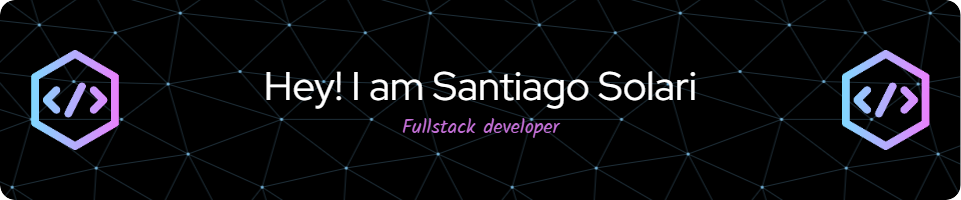

 <!--
--> 

# Welcome to Santiago Solari's GitHub  

- 🎓 I'm a Developer Full Stack 
- 💻 I’m currently studying at university 
- ⚡ I love programming, coffee, videogames, develop in backend.

### Skills Languages

### Skills Frameworks, Platforms and Libraries

### Skills DataBase

### Other Skills 

### IDEs/Editors

----

### Find me on  
   

---

Last Edited on: 31/07/2025
